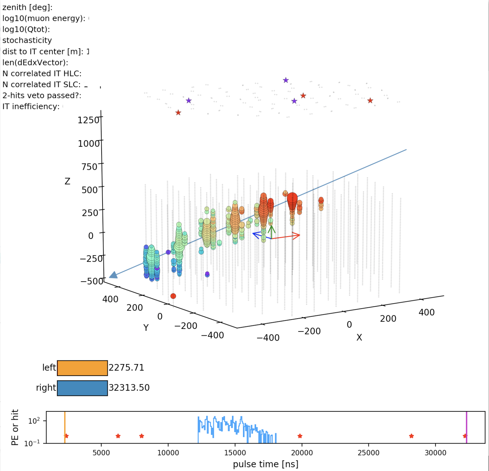

# steamshovel_in_python

- This is a python version of `steamshovel` that is used to display IceCube events.
- One must first store pulses into `hdf5` files, and then read the `.h5` file using the above python scripts.
- When reading in a folder containing `.h5` files, one could use arrow keys on the keyboard to navigate bewteen different events. 
- When reading in a single `.h5` file, one could click on the colored range button to select time range for displaying the pulses.

The figure below shows the visualization of an example event. Key information has been masked out. 

